# Setting Up AirSync with Confluence

Now that we have Articles via manual and scrapping using a tool, the next step is to import information from another tool ACME uses inside their organization, Confluence. 

!!! Example "Be aware"
    For AirSync with Confluence to work, there are some pre-requisite steps that need to be taken:

    * Admin access to your DevRev org  
    * Confluence Cloud account with admin rights  
    * Ability to generate a Confluence API token

    Without these AirSync can not be run. For more information on AirSync and specifically Confluence, use this link: [https://support.devrev.ai/en-US/devrev/article/BOVjni26-confluence-airsync](https://support.devrev.ai/en-US/devrev/article/BOVjni26-confluence-airsync) 

    For the workshop we will be using a Pre-Created Confluence environment that is controlled by DevRev SEs. The needed information has been sent by email and will **NOT** be shared in this document (including screenshots)\!  

### Step 1: Install the Confluence AirSync Snap-in {#step-1:-install-the-confluence-airsync-snap-in}

➔ Navigate to Snap-ins in the *Integration* section in the Settings panel.

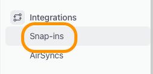

*Image 39\. Location of the Snap-ins.*

➔ In the panel that is shown, click on the **All Snap-ins** tab and in the *Search* bar type **Confluence**. From the results click **Confluence** to go to the specific page for this Snap-in

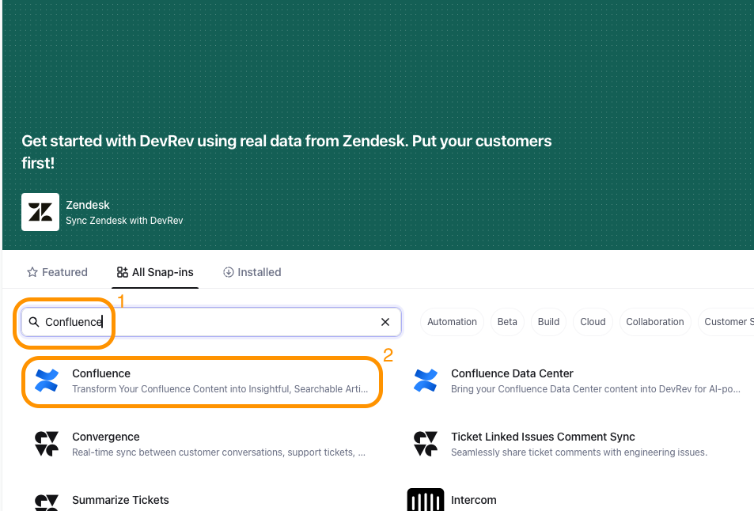

*Image 40\. Getting the Confluence Snapin.*

➔ In the top right corner of the screen that just opened click the **Install** button. In the new screen that opens, toggle the switches **Article Visibility** and **Import as External**

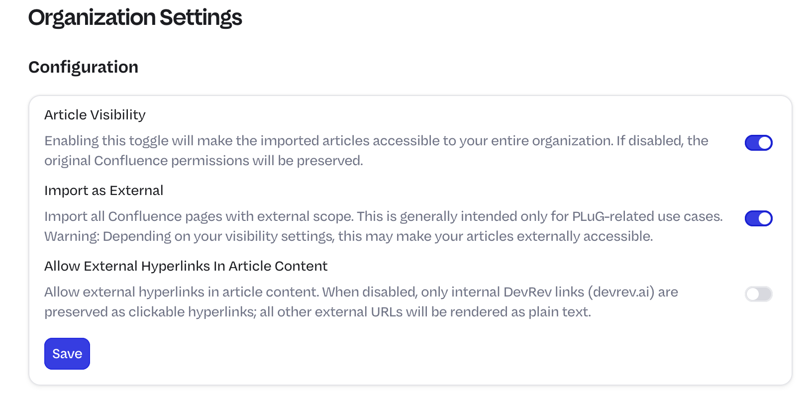{% width=50% %}

*Image 41\. Toggle switches for Article Visibility.*

➔ Click **Save** and **Install Snap-in**. Notice that the button has changed into other options: **Events, Start AirSync** and **Configure**.

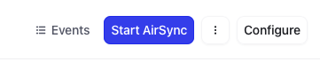

*Image 42\. Change of options in the Snap-in after Save and Install.*

In Events all items that have a relationship to this Snap-in have been mentioned. It can be used for internal changes that need to be stored for auditing reasons as example, but also to update admins on any possible changes that have been made.  
Configure brings back the toggle switches that have been seen earlier.

### Step 2: Configure the AirSync {#step-2:-configure-the-airsync}

➔ Click **Start AirSync** and you will asked to type of the connection for *Confluence*. 

➔ Click **PAT**.  

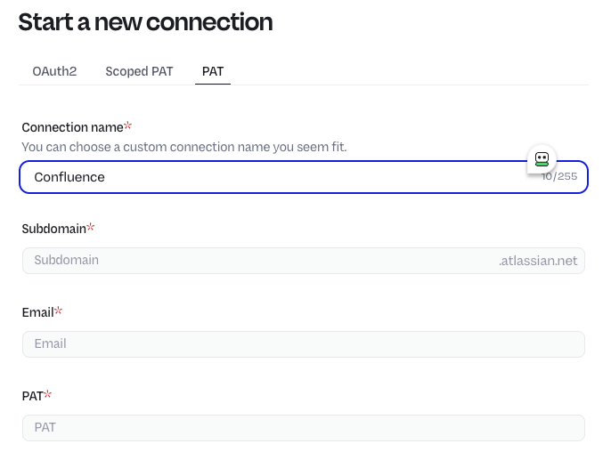

*Image 43\. Type of connection.*

➔ In the Start a new connecion, use the following information (all information is from the email you have received):

  - **Connection name:** Confluence  
  - **Subdomain:** The URL of your Confluence site,**<YOUR_SITE\>**.atlassian.net  
  - **Email:** The email address that belongs to the PAT  
  - **PAT:** The Personal Access Token from the email

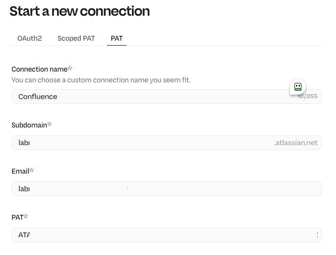

*Image 44\. PAT connection example.*

➔ Click the **Next** button.

➔ In the screen that appears select the data source from the received email.

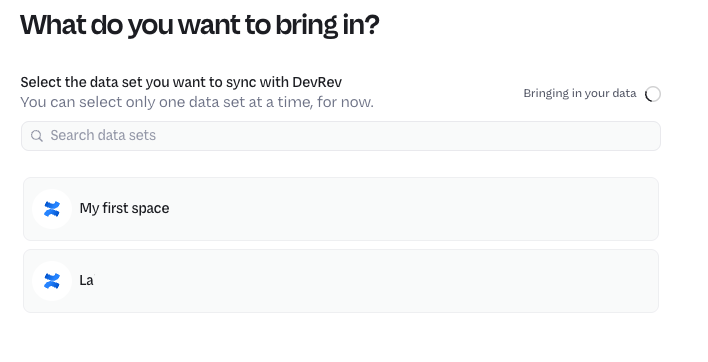

*Image 45\. Setup the source and start the AirSync.*

➔ Click the **Next** button.  

➔ In the *Select time frame* screen, leave the default (All) selected and click **Next**

### Step 3: Map fields between Confluence and DevRev {#step-3:-map-fields-between-confluence-and-devrev}

➔ In the screen that appears **Field Mappings** are shown. By default the AirSync maps the fields from Confluence to the fields in DevRev. You will also get an email with the same sort of message.

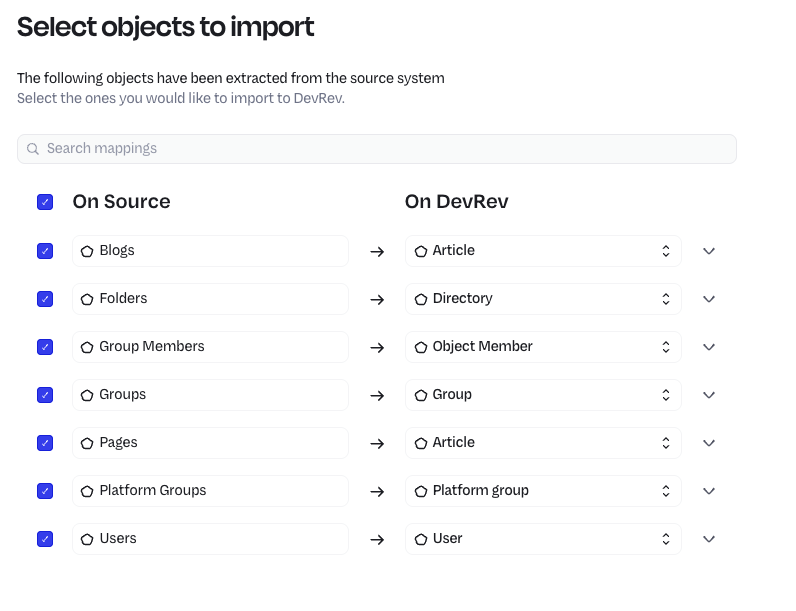

*Image 46\. Setup Field Mapping notification.*  

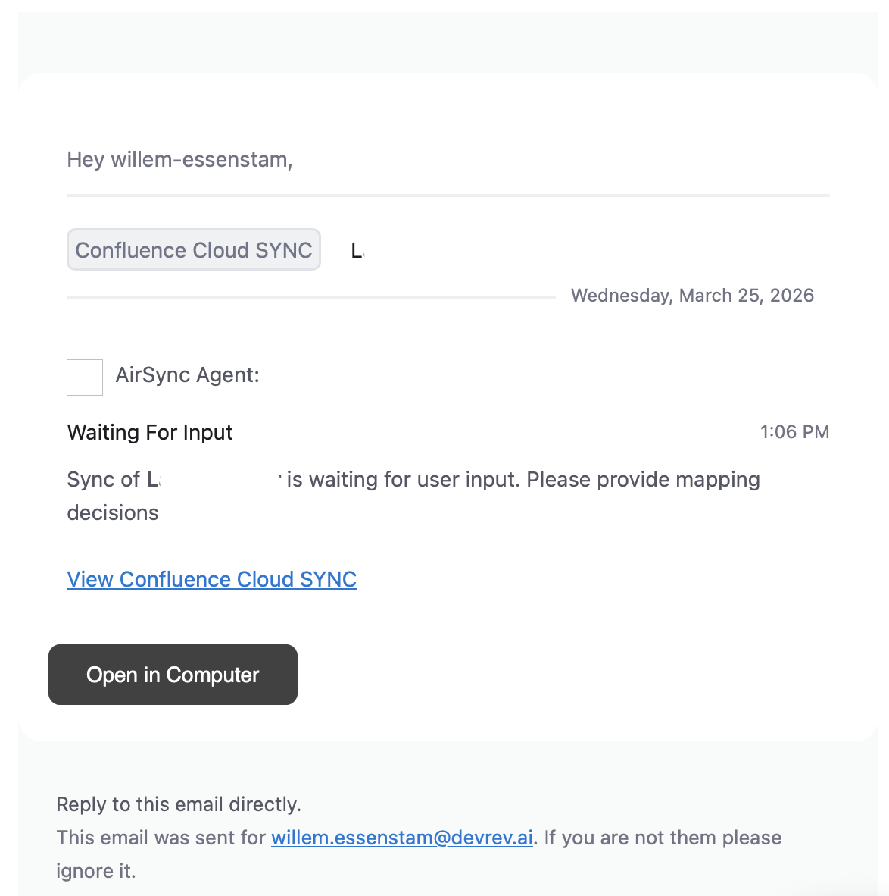{ width=50% }

*Image 47\. Setup Field Mapping notification as email.*

➔ Click **Finish**, a new screen appears.

### Step 4: Checking the AirSync {#step-4:-checking-the-airsync}

➔ After a few seconds, the Sync status column has changed into **In sync**. 

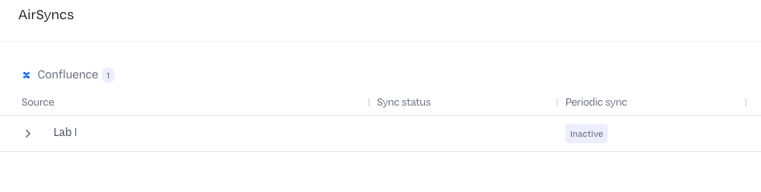

*Image 49\. The AirSync status.*

➔ By clicking on the line, that shows the source name, details are shown on the sync that has happened. 

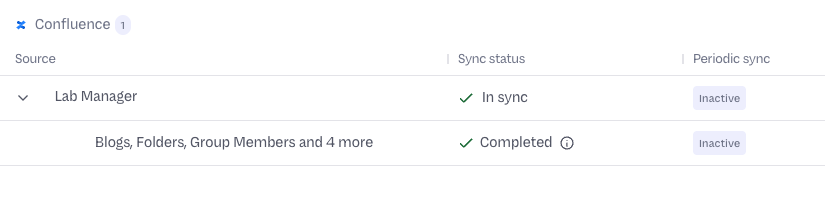

*Image 50\. The AirSync detailed status.*

➔ Click the line that shows *Blogs, Folders, Group Members...* to see the details

➔ On the **History** tab it shows what has been mapped from Confluence into DevRev and what happened to the items (CRUD)  

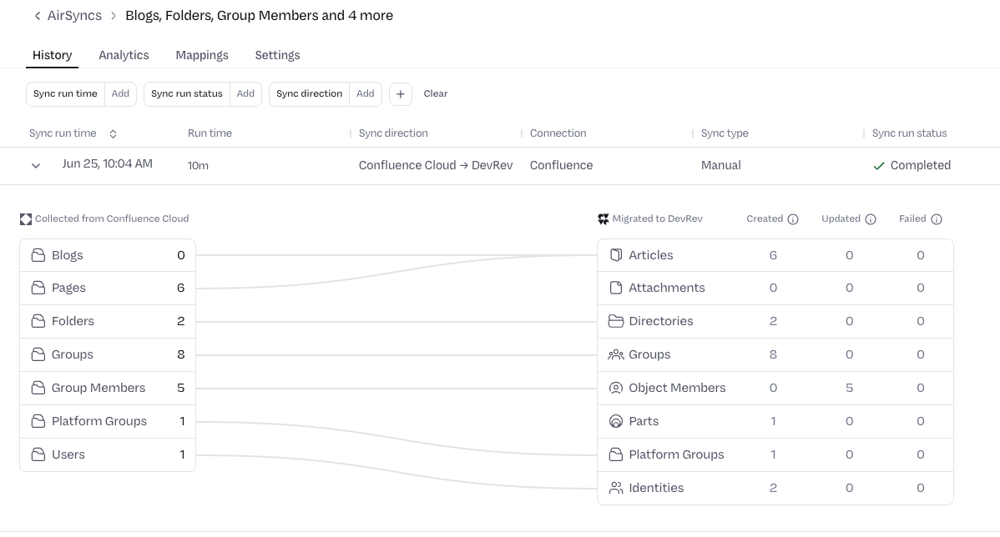

*Image 51\. The AirSync historical status details.*

➔ Via the **Analytics** tab, you can see statistics on the articles that have been sync-ed. As it just is sync-ed and it takes approx. 24 hours to see anything, skips this tab for now.

➔ Under the **Mappings** tab, you could could make changes if the information is not correctly imported into DevRev.  

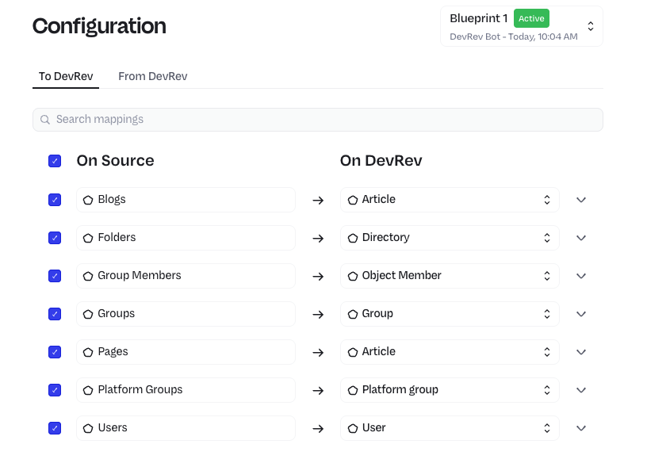

*Image 52\. The AirSync field mappings details.*

!!! Example "Be aware"
    In the top right corner you see the text **Blueprint 1**. All changes you might have made are stored as a Blueprint for the mapping. To revert to a previous active blueprint use one of the below options:
  
    - "Reset changes" button - This resets field mappings for a given record type back to the connector defaults (what the external domain metadata and the connector developers suggest). It does not reset to what you had at the start of the session, and it does not reset to the state in the latest active blueprint .
    - Partial reimport - If you've changed field mappings in the blueprint and applied them, AirSync can perform a partial reimport limited to just the affected fields (and optionally a time window). This re-applies the new mapping to already-imported data but doesn't reverse the change .
    - Data already in DevRev is not deleted when you modify mappings - it remains as-is, and only future syncs use the new configuration. If you unselect a record type, existing records stay but become "disconnected" from the external system .

➔ Under the Settings tab, this is where the following items can be set and/or updated:

1. **Subscribers;** the group/people who need to be updated on anything related to this AirSync  
2. **Periodic sync;** how often should this AirSync run and which way should there be a synchronization (Confluence AirSync can only Pull data into DevRev. Other, like Jira, can be a two-way synchronization). Also notifications can be set up for the periodic sync. Having a periodic sync makes it possible to import newly created items and have the latest and greatest in DevRev.  
3. **Archive;** This will stop the synchronization and the AirSync becomes Archived as state. Sync-ed information will stay and this action can be reverted.  
4. **Delete;** This is a non reverted action\!

*Image 53\. The AirSync Settings details*

!!! Example "Why Archive?"
    A use case for Archive might be that due to maintenance the data source is not responding and the Subscribers and people don’t want to get notified due to a known issue. Putting the AirSync into Archive stops all without making any other changes to the settings.  

➔ No changes have to be made.

<B>This concludes this module of the workshop</B>

