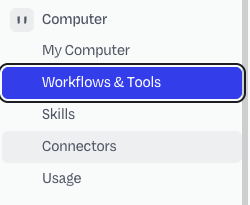
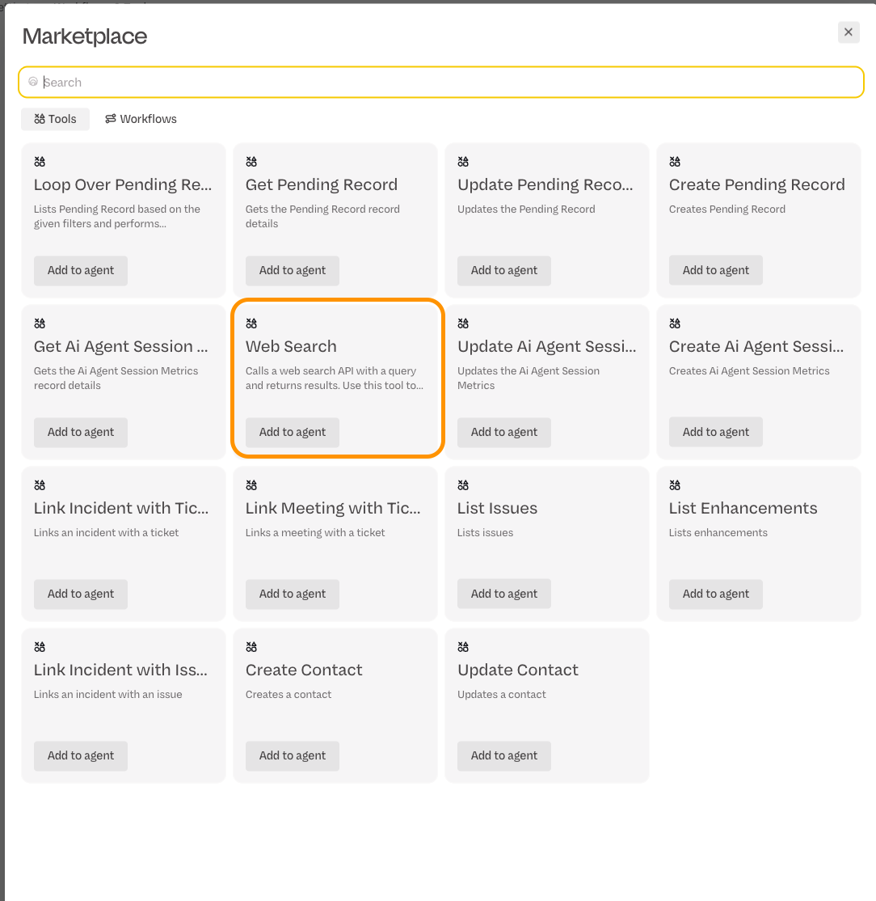
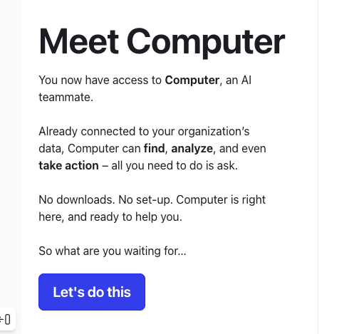
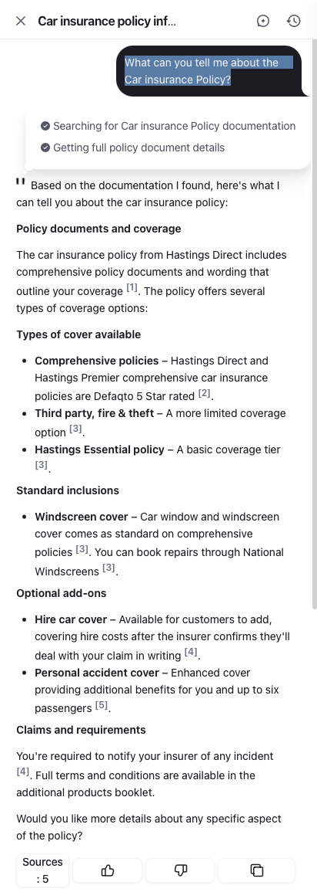
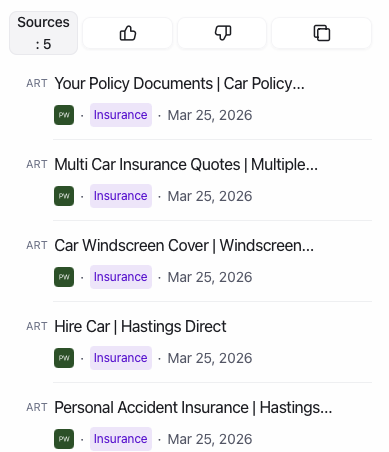
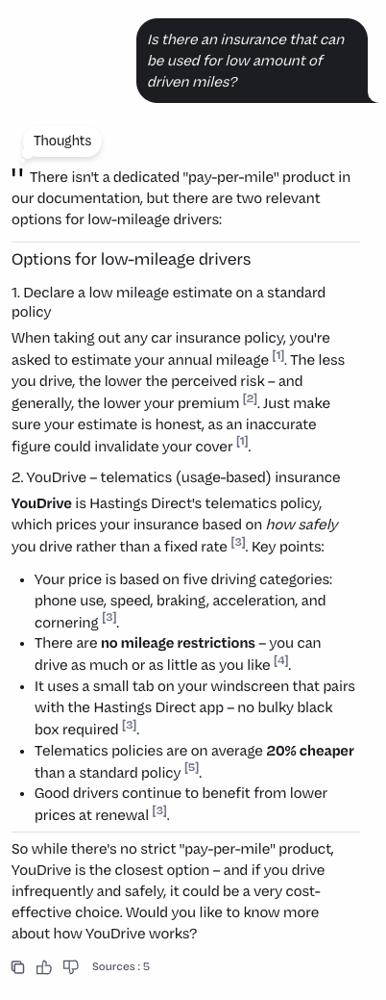
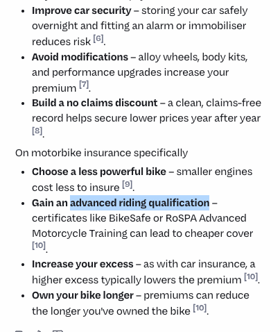
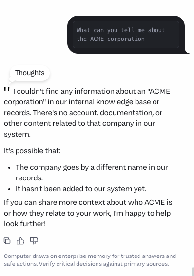

# Lab 2\. Exercise 1: Testing AI Agent (Computer) {#lab-2.-exercise-1:-testing-ai-agent-(computer)}

**Objective**

Test the AI Agent to use the created and AirSync-ed Knowledge Base articles to answer questions. Not just very simple questions that are straightforward but also complex questions that require reasoning.

**What You Will Build**

* Configure an AI agent  
* Test the AI Agent

**Exercise steps**

Now that we have some experience with articles, manual creation, web scrapper and AirSync, we need to test the AI Agent to see what we get back from some queries.

## Step 1: No Internet Access check {#step-1:-no-internet-access-check}

First we want to make sure the AI Agent is not able to connect to the internet and search for answers. 

➔ Navigate to **Settings -> Computer -> Workflow & Tools** all the way at the bottom of the Settings navigation pane in the *Computer* section.

*Image 54\. The location of the Computer settings*

➔ In the screen that is now on the right, we don't see any capabilities. This implies that the skill **Websearch** is not enabled. To be sure, click the **+ Add capabilit** button and search for the Websearch and see that there is a text called **Add to agent**

*Image 55\. The location of the Web search enabled button.*

➔ Now we no for 100% sure that Computer is not capable of going onto the internet to search for information. It can only use Memory for its answering of queries. Close the screen by clicking the **X** in the top right corner.

➔ Click **< Settings** at the top of the navigation pane to return to the “normal” user’s UI.

*Image 56\. The text < Settings to click.*

## Step 2: Test 1 \- A relative simple question {#step-2:-test-1---a-relative-simple-question}

!!! Example "Before we start"
    Due to the amount of time speed between the running of S.P.I.D.E.R. (the scrapping of the webiste) and the conversation with Computer, the amount of scources might differ. Remember that there were approx. 300 pages that have turned into articles. Known numbers of sources are between five and eight. 
    
    The shown screenshots are examples and your answer might slightly differ, due to the fact that insurances change and we don't control the content of the webpage we are scrapping the information from.

➔ Click the text **“Let’s do this”** at the bottom of the navigation pane.   

*Image 56\. The button Let’s do this to click.*

➔ Ask the following question:”*What can you tell me about the Car insurance Policy?*”. You will see that the agent is going through the “onboard” articles to find answers. After a few seconds Computer generates an answer which looks something like:  
“   
*Based on the documentation I found, here's what I can tell you about the car insurance policy:*

*Policy documents and coverage*

*The car insurance policy from Hastings Direct includes comprehensive policy documents and wording that outline your coverage [\[1\]](https://www.hastingsdirect.com/car-insurance/policy-info/policy-booklets). The policy offers several types of coverage options:*

*Types of cover available*

* *Comprehensive policies – Hastings Direct and Hastings Premier comprehensive car insurance policies are Defaqto 5 Star rated [\[2\]](https://www.hastingsdirect.com/car-insurance/multi-car-insurance/).*  
* *Third party, fire & theft – A more limited coverage option [\[3\]](https://www.hastingsdirect.com/car-insurance/policy-features/windscreen-cover/).*  
* *Hastings Essential policy – A basic coverage tier [\[3\]](https://www.hastingsdirect.com/car-insurance/policy-features/windscreen-cover/).*

*Standard inclusions*

* *Windscreen cover – Car window and windscreen cover comes as standard on comprehensive policies [\[3\]](https://www.hastingsdirect.com/car-insurance/policy-features/windscreen-cover/). You can book repairs through National Windscreens [\[3\]](https://www.hastingsdirect.com/car-insurance/policy-features/windscreen-cover/).*

*Optional add-ons*

* *Hire car cover – Available for customers to add, covering hire costs after the insurer confirms they'll deal with your claim in writing [\[4\]](https://www.hastingsdirect.com/car-insurance/policy-features/hire-car).*  
* *Personal accident cover – Enhanced cover providing additional benefits for you and up to six passengers [\[5\]](https://www.hastingsdirect.com/car-insurance/policy-features/personal-accident).*

*Claims and requirements*

*You're required to notify your insurer of any incident [\[4\]](https://www.hastingsdirect.com/car-insurance/policy-features/hire-car). Full terms and conditions are available in the additional products booklet.*

*Would you like more details about any specific aspect of the policy?*

“

➔ Click on the Thoughts text and see what the agent has done to get to the answer.

*Image 57\. The first reply of the AI Agent.*

➔ The sources that the Agent used, with reasoning, to formulate the answer are shown at the bottom of the answer. 

➔ Click the **Sources** text and see the sources

*Image 58\. The sources the AI Agent used.*

## Step 3: Test 3 \- A more complex question {#step-3:-test-3---a-more-complex-question}

Now that we are getting an answer to a relatively simple question that cannot have come from the internet, ask a more complex question. 

➔ The question to raise is:”*Is there an insurance that can be used for low amount of driven miles?*”.

Again the Agent reach out to the articles and queries the information to find an answer:  

“  
There isn't a dedicated "pay-per-mile" product in our documentation, but there are two relevant options for low-mileage drivers:

---

## Options for low-mileage drivers

### 1. Declare a low mileage estimate on a standard policy
When taking out any car insurance policy, you're asked to estimate your annual mileage [1]. The less you drive, the lower the perceived risk – and generally, the lower your premium [2]. Just make sure your estimate is honest, as an inaccurate figure could invalidate your cover [1].

### 2. YouDrive – telematics (usage-based) insurance
**YouDrive** is Hastings Direct's telematics policy, which prices your insurance based on *how safely* you drive rather than a fixed rate [3]. Key points:

- Your price is based on five driving categories: phone use, speed, braking, acceleration, and cornering [3].
- There are **no mileage restrictions** – you can drive as much or as little as you like [4].
- It uses a small tab on your windscreen that pairs with the Hastings Direct app – no bulky black box required [3].
- Telematics policies are on average **20% cheaper** than a standard policy [5].
- Good drivers continue to benefit from lower prices at renewal [3].

---

So while there's no strict "pay-per-mile" product, YouDrive is the closest option – and if you drive infrequently and safely, it could be a very cost-effective choice. Would you like to know more about how YouDrive works?

“

*Image 59\. The more complex answer to the question.*

## Step 4: Test 4 \- Having a conversation {#step-4:-test-4---having-a-conversation}

➔ Based on the answer with *YouDrive* we want to know more about that option. So ask:“*Now you found the YouDrive insurance, but can that also be used for motorcycles and how can the premium be cheaper?*”. Computer thinks a bit and replies with an answer that provides something in the line of, that YouDrive is not available for Motor cycles, but there are other options for lowering the cost of an insurance. 

➔ One option is interesting in the answer give: “advanced riding qualification”. 

*Image 59\. The interesting option*

➔ We want to know more on that option ask:”*What are those advanced riding qualifications you refer too?*”. Computer is thinking again and comes back with a great answer by reasoning and looking at the information it has access to:  

”
Our documentation mentions three recognised advanced riding qualifications that can help lower your motorbike insurance premium [1]:

---

## Advanced riding qualifications

- **BikeSafe certificate** – a police-led motorcycle assessment programme that evaluates your riding skills and gives you personalised feedback to improve your safety on the road [1].

- **Enhanced Rider Scheme (ERS)** – a government-backed training programme designed to help riders of all experience levels improve their skills and ride more safely [2.

- **RoSPA Advanced Motorcycle Training** – an advanced riding course run by the Royal Society for the Prevention of Accidents (RoSPA), one of the UK's most well-known road safety organisations [1].

---

The key thing to note is that the qualification **must be recognised by your insurance provider** for it to result in a discount [1]. It's also worth mentioning that taking an advanced riding course doesn't just save you money – it can genuinely make you a safer rider [3].

“

## Step 5: Test 5 \- Ask an internet access question {#step-5:-test-5---ask-an-internet-access-question}

➔ To be sure that the agent cannot access the internet ask the following question:”*What can you tell me about the ACME corporation*”. Even though there is no real information, which is given by the agent, it still provides a professional answer that “  
*“*  
*I couldn't find any information about an "ACME corporation" in our internal knowledge base or records. There's no account, documentation, or other content related to that company in our system.*  
*“*

*Image 60\. Random question asked and answered by AI Agent*

<B>This concludes this module of the workshop</B>

